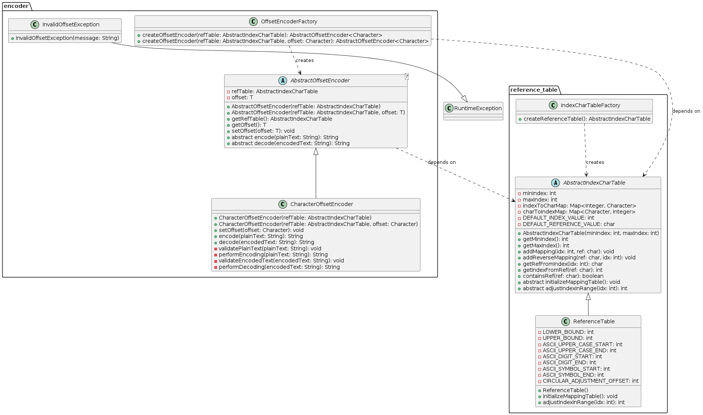
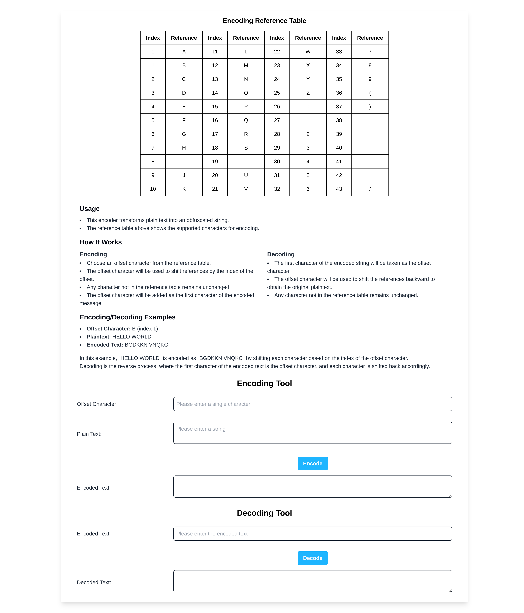
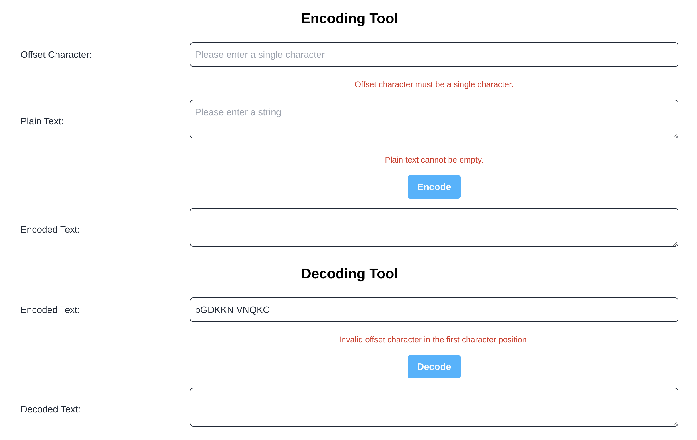
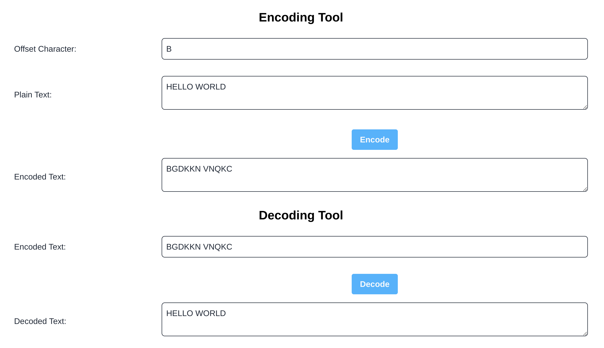

# Encoding/Decoding Tool

## Introduction
This repository showcases an encoding/decoding tool. The encoder takes plaintext and encodes it into an obfuscated string using a character logic. The decoding process reverses this operation.

### Encoding Reference Table

| Index | Reference Table | Shift Table #1|
|-|-|-|
| 0  | A | / |
| 1  | B | A |
| 2  | C | B |
| 3  | D | C |
| 4  | E | D |
| 5  | F | E |
| 6  | G | F |
| 7  | H | G |
| 8  | I | H |
| 9  | J | I |
| 10 | K | J |
| 11 | L | K |
| 12 | M | L |
| 13 | N | M |
| 14 | O | N |
| 15 | P | O |
| 16 | Q | P |
| 17 | R | Q |
| 18 | S | R |
| 19 | T | S |
| 20 | U | T |
| 21 | V | U |
| 22 | W | V |
| 23 | X | W |
| 24 | Y | X |
| 25 | Z | Y |
| 26 | 0 | Z |
| 27 | 1 | 0 |
| 28 | 2 | 1 |
| 29 | 3 | 2 |
| 30 | 4 | 3 |
| 31 | 5 | 4 |
| 32 | 6 | 5 |
| 33 | 7 | 6 |
| 34 | 8 | 7 |
| 35 | 9 | 8 |
| 36 | ( | 9 |
| 37 | ) | ( |
| 38 | * | ) |
| 39 | + | * |
| 40 | , | + |
| 41 | - | , |
| 42 | . | - |
| 43 | / | . |

### Encoding Logic
- Choose any character in the reference table as the offset.
- The chosen character will be the offset character and it will be the first character of the encoded message.
- The encoded text will be shifted by the index of offset character.
- Any character not in the reference table will be mapped back to the same character.

**Encoding Example**
- If the offset character is 'B', the entire table will shift by one element down (Refer to Shift Table #1).
- Thus, given the plaintext 'HELLO WORLD', it will be encoded to '**B**GDKKN VNQKC'.

### Decoding Logic
- The first character off the encoded text will be taken as the offset character.
- The encoded text will be matched backwards based on the offset character to get the original plaintext.
- Any character not in the reference table will be mapped back to the same character.

**Decoding Example**
- Given the encoded text '**B**GDKKN VNQKC', 'B' will be taken as the offset and decoded to 'HELLO WORLD' (Refer to Shift Table #1).

---

## Repository Structure
The repository is organized into two main folders:

1. **core_encoder**: This folder contains the core implementation of the encoding tool as per the requirements. It includes the encoding logic, decoding logic, and associated test cases. For detailed instructions on how to use this tool, please refer to the next section.

2. **web_application**: This is an extension to **core_encoder** and provides a simple demo on how the encoding tool can be used. This folder contains a web application to demonstrate how the coding tool can be deployed and accessed by users. The web application was built using React.js for the frontend and Spring Boot for the backend.

The Spring Boot web application depends on the classes from the core_encoder folder. The root directory contains a parent pom.xml file that orchestrates the build process. It first builds the core_encoder and then the Spring Boot application after the core_encoder is built.

---

## Folder: core_encoder

This folder contains the implementation of the encoding and decoding tool.
This project was built using Maven and it includes the additional dependencies and dependencies:
- JUnit5
- Mockito
- Maven Surefire Plugin (for testing during build process)

The key components in this code are:
- Reference Table: This class manages the mapping between indexes and characters.
- Encoder: This class implements the encoding and decoding logic based on the chosen offset character. It handles the encoding of plaintext to an obfuscated string and vice versa.

The code is tested using JUnit5 and Mockito.

### Design Overview




The design employs common object-oriented principles and design patterns to create a modular and flexible encoding/decoding tool.

- Abstraction: Defines a common interface (AbstractIndexCharTable, AbstractOffsetEncoder) without specifying implementation details, promoting code reusability.

- Encapsulation: Hides the internal state and implementation details of classes.

- Single Responsibility Principle: Each class has a single responsibility, such as managing the reference table (ReferenceTable), encoding/decoding text (CharacterOffsetEncoder), and handling exceptions (InvalidOffsetException).

- Dependency Injection: The AbstractOffsetEncoder class uses dependency injection to decouple from the AbstractIndexCharTable, enhancing testability and flexibility.

- Factory Pattern: The IndexCharTableFactory and OffsetEncoderFactory classes implement the factory pattern, providing a centralized way to create instances of AbstractIndexCharTable and AbstractOffsetEncoder, respectively, promoting code reusability and flexibility.

### Build Instructions for the core encoder (For Linux)

**Requirements:**
- JDK 21
- Maven

1. Clone the repository.

2. Navigate to the core_encoder directory:
    ```sh
    cd core_encoder
    ```

3. Clean and install:
    ```sh
    mvn clean install
    ```

---

## Folder: web_application

### Web Page Preview

**Full page**
- Displays the entire web page.


**Error Handling**
- If there are errors due to incorrect inputs.



**Successful Encoding and Decoding**
- When encoding and decoding operations are successful.




### Build Instructions for the web application (For Linux)

**Requirements:**
- Backend:
  - JDK 21
  - Maven (for core_encoder)
- Frontend:
  - Node.js: >= v21.7.3
  - npm: >= 10.5.0

1. Clone the repository.

2. In the root directory, run the following Maven commands to build the core_encoder and Spring Boot application:
    - Clean and install:
      ```sh
      mvn clean install
      ```

      Running these commands in the root directory ensures that the parent POM.xml will build the `core_encoder` first, followed by the Spring Boot application. As the Spring Boot application uses files from the `core_encoder`, this ensures that all dependencies are properly resolved.

3. Start the backend Spring Boot application:
    - From the root directory change into the directory containing Spring Boot:
      ```sh
      cd web_application/encoder.backend/
      ```

    - Run Spring Boot using either of the commands below:
      ```sh
      mvn spring-boot:run
      ```

      ```sh
      ./mvnw spring-boot:run
      ```

4. Start the frontend React.Js application:

  - In a new shell session starting from the root directory, go to the directory containing React.Js
      ```sh
      cd web_application/encoder-frontend/
      ```

  - Install dependencies:
      ```sh
      npm install
      ```

  - Run the application either:
    1. To start in development mode

        ```sh
        npm run dev
        ```

    2. To preview a production build locally
        
        ```sh
        npm run build
        npm run preview
        ```
     
5. Access the webpage
  - http://localhost:3000 (both development mode and production build are using the same port).

---

### React.js
The React application was built using Vite and Tailwind CSS. It serves as a simple demo that allows users to try out the encoder class on a web page. 

The webpage provides a simple explanation of the encoder and decoder, and it includes functionality to make API calls to the Spring Boot application to encode/decode the text. Additionally, client-side validation is implemented to prevent erroneous inputs from being submitted, ensuring a smoother user experience.

### Spring Boot Application

The Spring Boot application was built using Maven and Spring Boot version 3.3.0. It is packaged as a JAR file using JDK 21.

This application has the following dependencies:
- Spring Web
- Spring Boot DevTools
- Dependency from the core_encoder folder (Ensure that it is built first).

The application contains a EncoderController class that provides the encode and decode methods. Server-side validation has been implemented to ensure that only valid inputs are processed. The application was tested using JUnit 5 and Mockito.

## Additional Notes
- The repository includes images in the `images` directory and a PlantUML file in the `uml` directory for design documentation.
